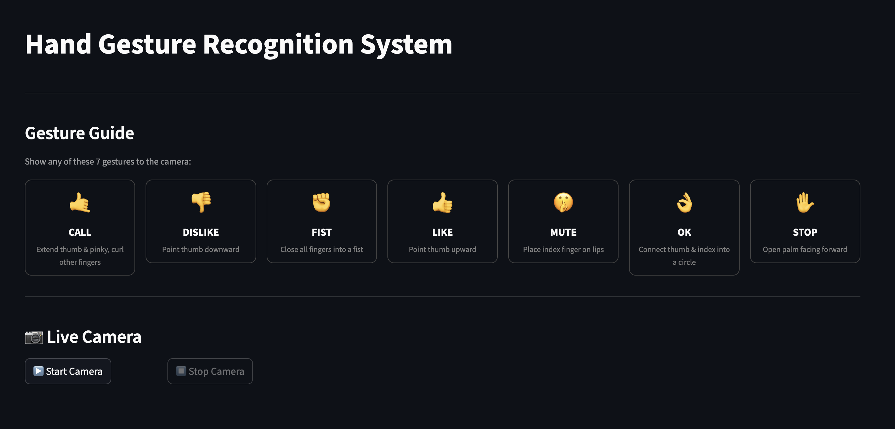
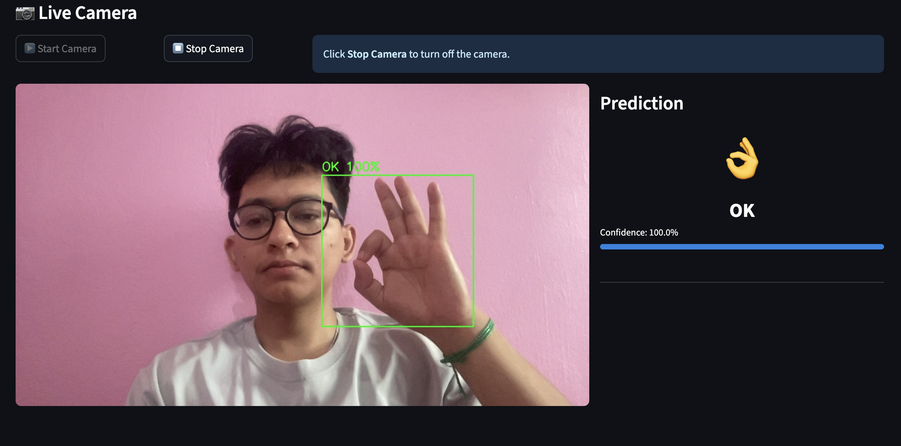

#  Hand Gesture Recognition

A real-time hand gesture recognition system using **EfficientNet-B0** and **MediaPipe**, achieving **99.64% test accuracy** across 7 gesture classes.

---
## Demo


---



##  Model Performance

| Metric | Score |
|--------|-------|
| Test Accuracy | **99.64%** |
| Macro Precision | 1.00 |
| Macro Recall | 1.00 |
| Macro F1-Score | 1.00 |

### Per-Class Results:
| Class | Precision | Recall | F1-Score | Support |
|-------|-----------|--------|----------|---------|
| call    | 1.00 | 0.99 | 0.99 | 1500 |
| dislike | 1.00 | 1.00 | 1.00 | 1500 |
| fist    | 1.00 | 1.00 | 1.00 | 1500 |
| like    | 0.99 | 0.99 | 0.99 | 1500 |
| mute    | 1.00 | 0.99 | 0.99 | 1500 |
| ok      | 1.00 | 1.00 | 1.00 | 1500 |
| stop    | 1.00 | 1.00 | 1.00 | 1500 |

### Confusion Matrix Analysis:
| Class | Correct | Misclassified |
|-------|---------|---------------|
| call    | 1492/1500 | 8  |
| dislike | 1494/1500 | 6  |
| fist    | 1498/1500 | 2  |
| like    | 1492/1500 | 8  |
| mute    | 1491/1500 | 9  |
| ok      | 1496/1500 | 4  |
| stop    | 1500/1500 | 0  |

---

##  Supported Gestures

| Gesture | Emoji | Description |
|---------|-------|-------------|
| call    | 🤙 | Thumb and pinky extended |
| dislike | 👎 | Thumbs down |
| fist    | ✊ | Closed fist |
| like    | 👍 | Thumbs up |
| mute    | 🤫 | Finger on lips |
| ok      | 👌 | OK sign |
| stop    | ✋ | Open palm |

---

## Project Architecture

```
Input Image (Camera Frame)
        ↓
MediaPipe Hand Detection
        ↓
Crop Hand Region (Square Bounding Box)
        ↓
Resize to 224×224
        ↓
Normalize (ImageNet mean/std)
        ↓
EfficientNet-B0 (pretrained on ImageNet)
        ↓
Linear Classifier (1280 → 7)
        ↓
Softmax Probabilities
        ↓
Predicted Gesture + Confidence
```

---

##  Project Structure

```
hand-gesturegit commit -m "first commit"/
├── app.py                           # Streamlit real-time inference app
├── train.ipynb                      # Training notebook (Kaggle)
├── best_model_hand_detection.pth    # Trained model weights
├── hand_landmarker.task             # MediaPipe hand detection model
├── requirements.txt                 # Python dependencies
└── README.md                        # This file
```

---

##  Dataset

| Property | Details |
|----------|---------|
| Source | HaGRID (Hand Gesture Recognition Image Dataset) |
| Classes | 7 |
| Images per class | 15,000 |
| Total images | 105,000 |
| Image size | 224×224 (cropped to hand region) |
| Train split | 80% → 84,000 images |
| Val split   | 10% → 10,500 images |
| Test split  | 10% → 10,500 images |

---

##  Preprocessing Pipeline

1. **Hand Detection** — MediaPipe HandLandmarker detects 21 hand landmarks
2. **Bounding Box** — Min/max of landmark coordinates with 10px padding
3. **Square Crop** — Crop made square for consistent aspect ratio
4. **Resize** — All images resized to 224×224
5. **Augmentation** (training only):
   - Random horizontal flip
   - Random rotation (±15°)
   - Color jitter (brightness=0.3, contrast=0.3, saturation=0.2)
6. **Normalization** — ImageNet mean `[0.485, 0.456, 0.406]` / std `[0.229, 0.224, 0.225]`

---

##  Model Details

| Property | Details |
|----------|---------|
| Architecture | EfficientNet-B0 |
| Pretrained weights | ImageNet |
| Input size | 224×224×3 |
| Output classes | 7 |
| Classifier head | Linear(1280 → 7) |
| Total parameters | ~5.3M |

### Training Strategy:

**Phase 1 — Feature Extraction (5 epochs):**
- Backbone frozen, only classifier head trained
- Optimizer: Adam (lr=1e-3)
- Final val accuracy: ~91.83%

**Phase 2 — Fine-tuning (20 epochs, early stopping):**
- All layers unfrozen
- Optimizer: AdamW (lr=1e-4)
- Scheduler: CosineAnnealingLR
- Early stopping: patience=5
- Mixed precision: float16 (GradScaler)
- Final val accuracy: ~99.78%

---

##  Installation

**1. Clone the repository:**
```bash
git clone https://github.com/LimbuSunil2058/hand-gesture-recognition.git
cd hand-gesture-recognition
```

**2. Install dependencies:**
```bash
pip install -r requirements.txt
```

**3. Place model file:**
```
Put best_model_hand_detection.pth in the project root folder
hand_landmarker.task downloads automatically on first run
```

---


##  Requirements

```
torch
torchvision
timm
mediapipe
opencv-python
streamlit
scikit-learn
matplotlib
seaborn
numpy
```

Install all at once:
```bash
pip install torch torchvision timm mediapipe opencv-python streamlit scikit-learn matplotlib seaborn numpy
```

---

##  Training Environment

| Property | Details |
|----------|---------|
| Platform | Kaggle Notebooks |
| GPU | Tesla T4 16GB |
| Framework | PyTorch 2.10 |
| Python | 3.12 |
| Total epochs | 13 (5 + 8) |
| Training time | ~1.5 hours |


## Acknowledgements

- [HaGRID Dataset](https://github.com/hukenovs/hagrid) — Hand gesture image dataset
- [MediaPipe](https://mediapipe.dev/) — Hand landmark detection
- [timm](https://github.com/huggingface/pytorch-image-models) — Pretrained EfficientNet-B0
- [PyTorch](https://pytorch.org/) — Deep learning framework
- [Streamlit](https://streamlit.io/) — Real-time inference UI

## Author

**Sunil Limbu**  
[GitHub](https://github.com/LimbuSunil2058)